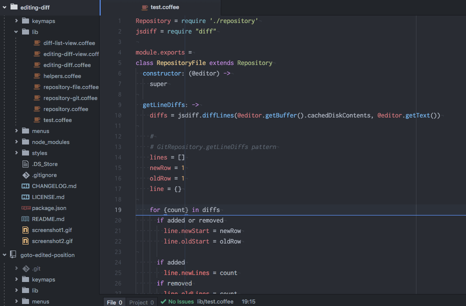
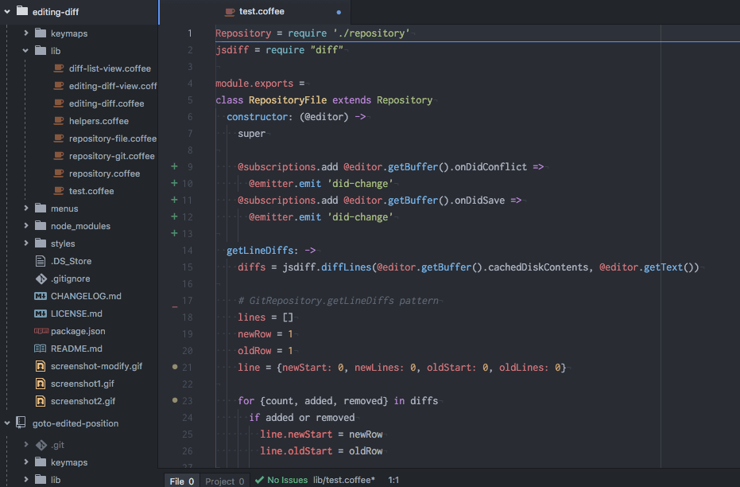

# Editing Diff package

## Git Ripository ([git-diff](https://atom.io/packages/git-diff))
Marks lines in the editor gutter that have been added, edited, or deleted since the last commit.  

最後のコミット以降、追加、編集、削除された行をマークします。  

## Not Git Ripository
Marks lines in the editor gutter that have been added, edited, or deleted since the last saved file.  

最後の保存以降、追加、編集、削除された行をマークします。  

## Preview
edit

move

list

## Keymaps
- `ctrl-up`   to move the cursor to the previous diff in the editor  
...前の差分にカーソルを移動
- `ctrl-down` to move the cursor to the next diff in the editor  
...次の差分にカーソルを移動
- `ctrl-d` show diff list  
...差分リストを表示

## Todo:
- [ ]

## 参考
[git-diff 0.57.0](https://atom.io/packages/git-diff) Function addition  
repositoryForPath -> git or file
